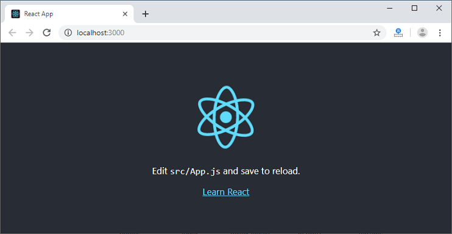

# Facebook-Developer-Circles-Community-Challenge-Tutorial

Learning The Fundamentals Of React By Building A Roll Call App

In this tutorial, we're going to be learning about React Js (A javascript library for building user interfaces)
Before we get started, in order to learn React, you'll have to already know some basics of html,css and javascript (especially es6).
If already do then that's great but if you don't then no worries, I've included some resources to learn in this repository 
for you to check out. We'll be covering topics in react such as state,components and lifecycle methods. Now, I know
most of you might say that there's already the react documentation at https://reactjs.org/ so why the need for this tutorial.
Well, it is often said that the best way to learn something is to practice it, reading documentations always will get you stuck in 
tutorial hell. You need to build something with your knowledge and if that's what you want to do then you're in the right place.
This is a tutorial for beginners in React so I'm going to have a very interactive and lively tutorial. Also, this is not
a copy and paste tutorial where I explain what some code does, you copy and paste it before you can progress in building
the app on your own. I certainly can't include every single line of code here so I'll the most important parts

Before we dive into react, we'll first have to install react. Since it's a javascript library it means we'll have to
install node js. Now you might start wondering, why node js well because it comes along with node package manager(npm). 
npm is a command line tool that will help us to install javascript libraries automatically. Amazing isn't it


Head over to https://nodejs.org/en/ and install the latest version(12.18.4) after installating you'll see a node js
command prompt installed. Create a folder you will want to host your react app in and navigate to it in the command line (still 
got no idea how, no worries) you can create folders in the cmd with the mkdir(make directory) command and you can move in and out
of directories with the cd(change directory). 
Normally, setting up the development environment is a stress for most beginners but thanks to some very helpful software enginners
everything needed to setup a working environment has been simplified (Cheers to them).

Now after navigating to your desired folder in the node js cmd, type `npm init react-app roll-call-app` the "roll-call-app" section is up to you to decide 
depending on your projects name. Now that we have everything in place, type `npm start` in the cmd and you'll notice that  http://localhost:3000
opens with this page


Also, we see a prebuilt app structure already created for us
```
my-app
├── README.md
├── node_modules
├── package.json
├── .gitignore
├── public
│   ├── favicon.ico
│   ├── index.html
│   └── manifest.json
└── src
    ├── App.css
    ├── App.js
    ├── App.test.js
    ├── index.css
    ├── index.js
    ├── logo.svg
    └── serviceWorker.js
    └── setupTests.js
```

Now that we're all set, it's time to dig in and build our roll call app. You might know of a roll call where attendace of students/people at a particular event is
tracked well how about if we built one in react that would be a great way to learn. This roll call app has been particularly designed for use in Ghanaian High Schools

Delete everything in src and create three new folders. Components will serve as where a link between all the pages is and the rest I guess are self explanatory.

`
src
├── components
|   ├── Appbar.js
├── images
├── pages
|   ├── Home.js
|   ├── Home.css
|   ├── App.js
|   ├── App.css
|   ├── History.js
|   ├── History.css
|   ├── Edit.js
|   ├── Edit.css
|   ├── Settings.js
|   ├── Settings.css
`

Here's how it's going to work, there will be an edit page where the user of the app can enter the names of the students and a new roll call page where the roll call will be conducted, after which the conducted roll call will be saved in a page called history. Apart from css, we'll be using other javascript libraries to augment our work
so in the directory of the app we'll have to install them into node_modules (a module in Node. js is a simple or complex functionality organized in single or multiple JavaScript files which can be reused throughout the Node. js application.) and install these necessary libraries
`npm install @material-ui/core`
`npm install @material-ui/icons`
`npm install @material-ui/lab`
`npm install react-google-charts`

I'll be using an appbar and hamburger menu from material ui for easy navigation
so in the top part of Appbar.js I import the necessary User Interface features from material UI such as the drawer, appbar, icons etc and I also import the other components
from pages in order to render each of them. I start with code to diplay the drawer
and link the components together

Now, I have a working drawer that renders different components but doesn't display anything so we move into Edit.js. We start by importing all the libraries we need 
such as material table, and ui features from material ui after all that
we'll create two class components. Since I assume you already have knowledge in javascript, the components I'm talking about here are similar
to functions in js. They are bits of reusable code but they return html via the render function. One to render the material-table and another 
to be a front page of the edit page
In my code, you might notice you're seeing extends component and will be wondering why
do I have to extend component?


Well, it's because you have to extend component in order to gain access to react's lifecycle methods such as componentdidmount,componenddidupdate etc.
So it's like saying, hey React, I would like to create my own class component but I'll like to use some of your functions in my component to help me out.
You might have also noticed constructor props and super props. The constructor can be used to bind event handlers to the 
component and/or initializing the local state of the component. State is where you store property values that belong to an 
a component

